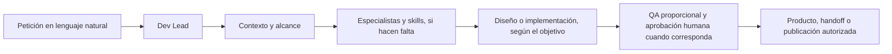

# CN Pilot

**Human-first web development harness for AI agents.**

Kilo Code nativo · agnóstico al proveedor/modelo dentro de Kilo

CN Pilot coordina el trabajo de proyectos web con agentes de IA sin convertir a la persona en operadora de una cadena de herramientas. Describe el resultado en lenguaje natural; el sistema inspecciona el contexto, activa solo el proceso necesario y mantiene las decisiones importantes bajo control humano.

[Empieza aquí](.blueprint/docs/START-HERE.md) · [Configuración de Kilo](.blueprint/docs/KILO-SETUP.md) · [Documentación](#documentación) · [Repositorio](https://github.com/LuisYGM/cn-pilot)

> **Estado actual:** integración nativa con Kilo Code. El contenido de este repositorio está en español. El CN Pilot Core/harness se distribuye bajo [GNU GPL v3.0 or later (`GPL-3.0-or-later`)](LICENSE); consulta el [alcance y las atribuciones por componente](#licencia-y-atribuciones).

## El problema que resuelve

En un proyecto web asistido por IA, alguien suele tener que traducir cada petición a instrucciones técnicas, elegir manualmente especialistas y herramientas, reconstruir contexto, decidir cuándo revisar y vigilar que el trabajo no avance a producción sin autorización. CN Pilot organiza esas responsabilidades para que la conversación pueda empezar por el objetivo, no por la mecánica interna.

Sirve para proyectos web nuevos y existentes: sitios estáticos, contenido y SEO, WordPress, WooCommerce, plugins, themes, Bricks, Elementor, PHP, APIs y combinaciones de entregables. El stack y el alcance real deciden qué fases hacen falta; no se presupone que cada proyecto necesite todas.

## Cómo funciona

El diagrama representa caminos posibles, no una secuencia obligatoria. Una tarea acotada puede ir directamente a implementación y verificación; otra puede detenerse en contenido, diseño o handoff. La publicación y las operaciones remotas conservan su aprobación.

### Human-first, de principio a fin

- La persona explica qué necesita con sus propias palabras; no requiere prompt engineering ni conocer rutas, agentes o skills.
- Dev Lead inspecciona el contexto y pregunta solo si falta una decisión material.
- Greenfield y Existing parten de sus fuentes reales; en proyectos existentes se preserva la implementación vigente.
- Diseño y desarrollo se separan cuando aporta valor: **Design → aprobación visual → implementación → QA**, sin activar fases posteriores por rutina.
- La profundidad se ajusta al riesgo. Acceso a producción, datos, seguridad, publicación y decisiones costosas permanecen bajo control humano.

## Inicio rápido

No hay instalador ni CLI: el uso actual consiste en abrir este workspace con VS Code y Kilo Code.

1. Usa [`cn-pilot`](https://github.com/LuisYGM/cn-pilot) como template de GitHub, clónalo o copia sus archivos a una carpeta de trabajo. Git puede usarse, pero no es requisito del harness.
2. Abre la carpeta del repositorio en VS Code e instala/activa la extensión Kilo Code.
3. Configura en Kilo un proveedor y un modelo disponibles para tu cuenta. CN Pilot no prescribe proveedor ni modelo. Sigue [Configuración de Kilo](.blueprint/docs/KILO-SETUP.md).
4. Selecciona **Dev Lead** (`dev-lead`) como interlocutor y ejecuta `/doctor` para comprobar localmente la integridad del harness.
5. Ejecuta `/new-project` una vez en la carpeta de trabajo. Resume el proyecto nuevo o existente cuando Dev Lead lo solicite.
6. Describe en lenguaje natural el resultado que quieres conseguir. Para empezar a trabajar sobre la web: `/new-project` registra el contexto; no mueve ni adopta código por sí solo.

Consulta el [recorrido del primer día](.blueprint/docs/START-HERE.md) para los pasos completos y escenarios Greenfield/Existing.

## Diseño, implementación y entrega

- **Greenfield:** contexto del proyecto primero; la implementación activa empieza cuando hay una tarea de desarrollo autorizada.
- **Existing:** se inspeccionan fuentes y estructura vigentes antes de intervenir; no se asume migración ni se sobrescribe trabajo existente.
- **Diseño:** cuando forma parte del alcance, un prototipo puede pasar por aprobación humana antes de implementarlo. Una solicitud solo de diseño se detiene en el entregable visual.
- **Implementación:** se adapta al stack confirmado y a la ubicación de producto registrada.
- **QA:** se seleccionan pruebas y revisiones relevantes, no una batería universal.
- **Entrega:** puede ser código, contenido, diseño, handoff o publicación mediante una integración autorizada. Publicar no está implícito.

## Compatibilidad actual

| Entorno | Estado | Qué significa |
|---|---|---|
| Kilo Code | **Nativo / soportado** | Agentes, comandos y skills están configurados para Kilo Code. |
| Proveedores y modelos dentro de Kilo | **Configurables** | CN Pilot no fija proveedor o modelo; la disponibilidad y configuración dependen de Kilo y de la cuenta de cada persona. |
| Claude Code | Sin adapter nativo actualmente | Algunos archivos podrían inspeccionarse manualmente; no existe una integración equivalente mantenida por el proyecto. |
| Codex | Sin adapter nativo actualmente | El uso manual de archivos no equivale a soporte nativo. |
| Cursor | Sin adapter nativo actualmente | No se declara portabilidad de runtime. |
| Gemini | Sin adapter nativo actualmente | No se declara adapter ni integración nativa. |

CN Pilot **no** afirma funcionar con cualquier agente ni ofrecer portabilidad multi-agent. “Agnóstico al proveedor/modelo” describe las opciones configuradas **dentro de Kilo Code**, no otros runtimes.

## Estructura de trabajo

La estructura ayuda al sistema a conservar límites y contexto; no necesitas aprenderla para pedir trabajo.

| Ubicación | En palabras sencillas |
|---|---|
| `project-resources/` | Material que se recibe para el proyecto, como referencias o archivos de entrada. |
| `project-artifacts/` | Entregables de trabajo y revisión: contenido, diseños, especificaciones y documentación auxiliar. |
| `product/` | Implementación activa real cuando el layout del workspace la ubica allí. |
| `.blueprint/` | Blueprint Core: documentación y estructura técnica interna de CN Pilot. |

La estructura interna del producto depende de su stack; un repositorio existente con contratos operativos puede conservar su root real documentada. Consulta el [layout y ciclo de vida](.blueprint/docs/LIFECYCLE.md).

## Agentes, skills y stacks

Dev Lead coordina; agentes especialistas y skills son mecanismos internos que se usan bajo demanda, no una lista de tareas manual que deba dirigir la persona. La colección cubre contenido/SEO, UX y diseño, frontend, desarrollo, WordPress/WooCommerce y revisiones específicas.

Se pueden trabajar proyectos HTML/CSS/JS, PHP, WordPress, Bricks, Elementor, WooCommerce, APIs, contenido y SEO cuando el alcance y las herramientas disponibles lo permiten. Esto no significa que CN Pilot instale o suministre esos stacks, ni que todas sus integraciones estén habilitadas por defecto. MCP y deployment son opcionales.

## Seguridad y proporcionalidad

Se inspecciona el estado vigente antes de editar; el acceso a secretos se limita, las credenciales no se versionan y una escritura sobre servicios reales requiere discovery y autorización. Las acciones destructivas, publicación, push y operaciones de producción no se ejecutan por defecto. La verificación corresponde al impacto del cambio; no es una garantía de seguridad absoluta.

## Documentación

- [Primer día y proyectos Greenfield/Existing](.blueprint/docs/START-HERE.md)
- [Configuración de Kilo](.blueprint/docs/KILO-SETUP.md)
- [Interacción human-first](.blueprint/docs/HUMAN-INTERACTION.md)
- [Ciclo de vida y entregas](.blueprint/docs/LIFECYCLE.md)
- [Seguridad](.blueprint/docs/SECURITY.md)
- [Configuración, MCP y deployment](.blueprint/docs/CONFIGURATION.md)
- [Troubleshooting](.blueprint/docs/TROUBLESHOOTING.md)
- [Especificación técnica para maintainers](.blueprint/BLUEPRINT.md)
- [Licencia y atribuciones](#licencia-y-atribuciones)

## Licencia y atribuciones

### Qué cubre la licencia del Core

El CN Pilot Core/harness que ofrece este repositorio se distribuye bajo [GNU GPL v3.0 or later (`GPL-3.0-or-later`)](LICENSE). **Usar CN Pilot, usar sus agentes o compartir repositorio no coloca automáticamente bajo GPL un producto independiente** creado por el usuario. El Core puede modificarse conforme a su licencia; el código, contenido y assets nuevos del usuario pueden tener licencia propia si son obras independientes y sus otras dependencias lo permiten. Así, un producto comercial, privado o bajo otra licencia puede coexistir con el Core cuando su autor tiene esos derechos y no incorpora material sujeto a términos incompatibles. La ubicación en `product/` o `project-artifacts/`, o en el mismo repositorio, por sí sola no decide esa relación.

Si una web o un plugin copia/adapta material expresivo del Core o de terceros, las condiciones pueden alcanzar ese material y, según la relación efectiva entre las obras, componentes combinados o derivados. No asumas independencia ni cobertura automática: evalúa qué se incorporó realmente. La salida de una herramienta GPL no queda automáticamente bajo GPL; importa si reproduce o constituye material cubierto. Consulta la [FAQ oficial GNU GPL sobre output](https://www.gnu.org/licenses/gpl-faq.html#WhatCaseIsOutputGPL) y [aggregate](https://www.gnu.org/licenses/gpl-faq.html#MereAggregation).

Crear un plugin WordPress con CN Pilot tampoco determina su licencia por el solo uso del harness; el stack, sus dependencias y el material realmente incorporado se evalúan por separado.

La GPL no prohíbe el uso o la venta comerciales: al distribuir material cubierto, sus destinatarios reciben los derechos y condiciones de esa licencia. Para copias/uso GPL privados que no se transmiten a otros, la GPL no exige publicar el código al público. Que un servicio esté alojado en una web no resuelve por sí solo qué archivos cubiertos se transmiten a sus usuarios. Estas notas explican la intención de alcance de CN Pilot, no determinan si un caso concreto es una obra derivada ni son asesoría legal.

`project-resources/` conserva las licencias de sus fuentes originales. No se asigna ni pregunta una licencia predeterminada para el producto durante `/new-project`.

### Atribuciones de material de terceros del Core

Las atribuciones se conservan junto a cada skill. Los textos completos de las licencias aplicables están en [`LICENSES/`](LICENSES/).

| Componente | Licencia upstream declarada | Atribución y detalle |
|---|---|---|
| [`ui-design-system`](.kilo/skills/ui-design-system/ATTRIBUTION.md) | Apache-2.0 | Heurísticas seleccionadas de Impeccable; no se incorpora su CLI/engine ni su NOTICE no aplicable a estas referencias. |
| [`accessibility-review`](.kilo/skills/accessibility-review/ATTRIBUTION.md) | MIT | Conocimiento adaptado de `web-accessibility`. |
| [`performance-review`](.kilo/skills/performance-review/ATTRIBUTION.md) | GPL-2.0-or-later | Conocimiento adaptado de `wp-performance`; la procedencia conserva la opción original «or later». |
| [`webapp-testing`](.kilo/skills/webapp-testing/ATTRIBUTION.md) | Apache-2.0 | Adaptación textual de Anthropic; no se copian scripts, ejemplos, browsers ni dependencias. |

La versión base del Blueprint Core se registra en `.blueprint-version`; no representa por sí sola una versión del producto CN Pilot.
